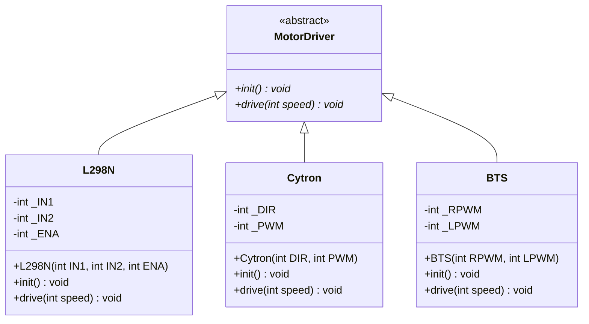

<div align="center">

# ⚙️ Motor Driver Abstraction Layer

**One interface. Three motor drivers. Zero rewiring of your logic.**

A lightweight, object-oriented C++ library for Arduino-compatible boards (STM32 / Arduino) that lets you control **L298N**, **Cytron**, and **BTS7960** motor drivers through a single, unified API.


</div>

---

## 📖 Table of Contents

- [Why This Exists](#-why-this-exists)
- [Supported Drivers](#-supported-drivers)
- [Architecture](#-architecture)
- [Project Structure](#-project-structure)
- [Getting Started](#-getting-started)
- [Wiring](#-wiring)
- [API Reference](#-api-reference)
- [How Each Driver Works](#-how-each-driver-works)
- [Usage Examples](#-usage-examples)
- [Adding a New Driver](#-adding-a-new-driver)
- [Notes & Gotchas](#-notes--gotchas)
- [Author](#-author)

---

## 💡 Why This Exists

Every motor driver speaks a slightly different language:

- The **L298N** wants two direction pins plus an enable PWM pin.
- The **Cytron** wants one direction pin plus one PWM pin.
- The **BTS7960** wants two PWM pins — one per direction.

Without an abstraction, switching hardware means rewriting your control code. This library hides those differences behind one interface:

```cpp
motor.init();
motor.drive(200);   // forward
motor.drive(-200);  // backward
motor.drive(0);     // stop
```

Swap the driver, keep the logic. ✨

---

## 🔌 Supported Drivers

| Driver | Class | Pins Required | Control Scheme |
|:--|:--|:--|:--|
| **L298N** Dual H-Bridge | `L298N` | `IN1`, `IN2`, `ENA` | 2 direction pins + 1 PWM enable |
| **Cytron** (MD10C / MD13S style) | `Cytron` | `DIR`, `PWM` | Sign-magnitude: 1 direction + 1 PWM |
| **BTS7960** (IBT-2) High-Current | `BTS` | `RPWM`, `LPWM` | Dual PWM: one per direction |

---

## 🏗️ Architecture

The library is built on a classic **Strategy / Polymorphism** pattern. `MotorDriver` is a pure abstract base class that defines the contract, and each concrete driver implements it for its own hardware.



Because every driver *is a* `MotorDriver`, higher-level code (a robot chassis, a PID controller, a teleop handler) can depend on the interface alone and never care which chip is underneath.

---

## 📁 Project Structure

```
.
├── main/
│   ├── MotorDriver.h   # Abstract base class (the interface)
│   ├── L298N.h         # L298N class declaration
│   ├── L298N.cpp       # L298N implementation
│   ├── Cytron.h        # Cytron class declaration
│   ├── Cytron.cpp      # Cytron implementation
│   ├── BTS.h           # BTS7960 class declaration
│   ├── BTS.cpp         # BTS7960 implementation
│   └── main.ino        # Demo sketch that exercises all three drivers
└── README.md
```

---

## 🚀 Getting Started

### Prerequisites

- [Arduino IDE](https://www.arduino.cc/en/software) (or PlatformIO)
- For STM32 boards: the [STM32duino core](https://github.com/stm32duino/Arduino_Core_STM32) installed via the Boards Manager
- At least one of the supported motor drivers, a DC motor, and a suitable motor power supply

### Installation

1. Clone the repository:
   ```bash
   git clone https://github.com/MahmoudSalama07/<repo-name>.git
   ```
2. Open `main/main.ino` in the Arduino IDE.
   > The Arduino IDE automatically compiles every `.cpp` / `.h` file in the sketch folder, so no extra setup is needed.
3. Select your board and port from **Tools**.
4. Click **Upload**.

The demo sketch will cycle each driver through **forward → backward → stop**, one second each.

---

## 🔧 Wiring

Default pin mapping used in `main.ino` (STM32 pin names):

### L298N

| L298N Pin | MCU Pin | Type |
|:--|:--|:--|
| `IN1` | `PB12` | Digital (GPIO) |
| `IN2` | `PB13` | Digital (GPIO) |
| `ENA` | `PA0` | PWM |

### Cytron

| Cytron Pin | MCU Pin | Type |
|:--|:--|:--|
| `DIR` | `PB14` | Digital (GPIO) |
| `PWM` | `PA1` | PWM |

### BTS7960

| BTS7960 Pin | MCU Pin | Type |
|:--|:--|:--|
| `RPWM` | `PA2` | PWM |
| `LPWM` | `PA3` | PWM |
| `R_EN`, `L_EN` | `VCC` | Tie HIGH (not managed by the class) |

> ⚠️ **Always connect the driver's GND to the microcontroller's GND.** Without a common ground, the control signals have no reference and the motor will behave erratically or not at all.

Any PWM-capable pin works for the PWM lines — just change the constants at the top of `main.ino`.

---

## 📚 API Reference

All drivers share the same two methods inherited from `MotorDriver`:

### `void init()`

Configures the driver's pins as `OUTPUT`. Call it once in `setup()` before driving.

### `void drive(int speed)`

Drives the motor at the given signed speed.

| `speed` value | Behavior |
|:--|:--|
| `> 0` | Spin **forward** at `abs(speed)` |
| `< 0` | Spin **backward** at `abs(speed)` |
| `0` | **Stop** |

The magnitude is written directly to `analogWrite()`, so with the default 8-bit PWM resolution the useful range is **`-255` to `255`**.

### Constructors

```cpp
L298N(int IN1, int IN2, int ENA);
Cytron(int DIR, int PWM);
BTS(int RPWM, int LPWM);
```

---

## 🔍 How Each Driver Works

<details>
<summary><b>L298N</b> — two direction pins + PWM enable</summary>

| `speed` | `IN1` | `IN2` | `ENA` |
|:--|:--|:--|:--|
| `> 0` | HIGH | LOW | `abs(speed)` |
| `< 0` | LOW | HIGH | `abs(speed)` |
| `0` | LOW | LOW | `0` |

Direction is set by the logic levels on `IN1`/`IN2`; speed comes from PWM on `ENA`.

</details>

<details>
<summary><b>Cytron</b> — sign-magnitude (direction + PWM)</summary>

| `speed` | `DIR` | `PWM` |
|:--|:--|:--|
| `> 0` | HIGH | `abs(speed)` |
| `≤ 0` | LOW | `abs(speed)` |

When `speed` is `0`, the PWM duty is `0`, so the motor stops regardless of direction.

</details>

<details>
<summary><b>BTS7960</b> — dual PWM</summary>

| `speed` | `RPWM` | `LPWM` |
|:--|:--|:--|
| `> 0` | `abs(speed)` | `0` |
| `< 0` | `0` | `abs(speed)` |
| `0` | `0` | `0` |

Each direction has its own PWM line; only one is active at a time, so the H-bridge is never driven both ways at once.

</details>

---

## 🧪 Usage Examples

### Basic — single motor

```cpp
#include "L298N.h"

L298N motor(PB12, PB13, PA0);

void setup() {
    motor.init();
}

void loop() {
    motor.drive(200);   // forward
    delay(1000);
    motor.drive(-200);  // backward
    delay(1000);
    motor.drive(0);     // stop
    delay(1000);
}
```

### Polymorphic — mixed drivers, one loop

This is where the abstraction pays off. Different hardware, identical code path:

```cpp
#include "L298N.h"
#include "Cytron.h"
#include "BTS.h"

L298N  leftMotor(PB12, PB13, PA0);
Cytron rightMotor(PB14, PA1);
BTS    armMotor(PA2, PA3);

MotorDriver* motors[] = { &leftMotor, &rightMotor, &armMotor };
const int MOTOR_COUNT = sizeof(motors) / sizeof(motors[0]);

void setup() {
    for (int i = 0; i < MOTOR_COUNT; i++) motors[i]->init();
}

void loop() {
    for (int i = 0; i < MOTOR_COUNT; i++) motors[i]->drive(180);
    delay(1000);
    for (int i = 0; i < MOTOR_COUNT; i++) motors[i]->drive(0);
    delay(1000);
}
```

### Dependency injection — hardware-agnostic logic

```cpp
void rampUp(MotorDriver& motor) {
    for (int s = 0; s <= 255; s += 5) {
        motor.drive(s);
        delay(20);
    }
}
```

`rampUp()` works with *any* driver — present or future.

---

## ➕ Adding a New Driver

Supporting a new motor driver takes three steps:

**1. Declare it** — `MyDriver.h`

```cpp
#ifndef MYDRIVER_H
#define MYDRIVER_H

#include "MotorDriver.h"

class MyDriver : public MotorDriver {
public:
    MyDriver(int pinA, int pinB);
    void init() override;
    void drive(int speed) override;

private:
    int _pinA;
    int _pinB;
};
#endif
```

**2. Implement it** — `MyDriver.cpp`

```cpp
#include "MyDriver.h"

MyDriver::MyDriver(int pinA, int pinB) : _pinA(pinA), _pinB(pinB) {}

void MyDriver::init() {
    pinMode(_pinA, OUTPUT);
    pinMode(_pinB, OUTPUT);
}

void MyDriver::drive(int speed) {
    // Translate the signed speed into your driver's control scheme
}
```

**3. Use it** — it plugs straight into any code that accepts a `MotorDriver`.

---

## ⚠️ Notes & Gotchas

- **Speed range:** Keep `speed` within `-255 … 255` (8-bit PWM). Values aren't clamped internally, so constrain them in your control code if needed:
  ```cpp
  motor.drive(constrain(output, -255, 255));
  ```
- **Low speeds:** The demo uses `±10`, which is only ~4% duty cycle. Many motors won't overcome static friction at that level — try `150`+ to see clear motion.
- **L298N `ENA` jumper:** Remove the jumper on the `ENA` header, otherwise the enable pin is tied HIGH and PWM speed control won't work.
- **L298N voltage drop:** Expect roughly 2 V lost across the L298N's bridge; size your motor supply accordingly.
- **BTS7960 enable pins:** `R_EN` and `L_EN` must be pulled HIGH for the driver to output anything.
- **Separate power:** Power motors from a dedicated supply, never from the microcontroller's 3.3 V / 5 V rail.

---

## 👤 Author

**Mahmoud Salama** — [@MahmoudSalama07](https://github.com/MahmoudSalama07)

If this helped you, consider giving the repo a ⭐!

---

<div align="center">
<sub>Built with ⚙️ and C++ — drive anything, change nothing.</sub>
</div>
